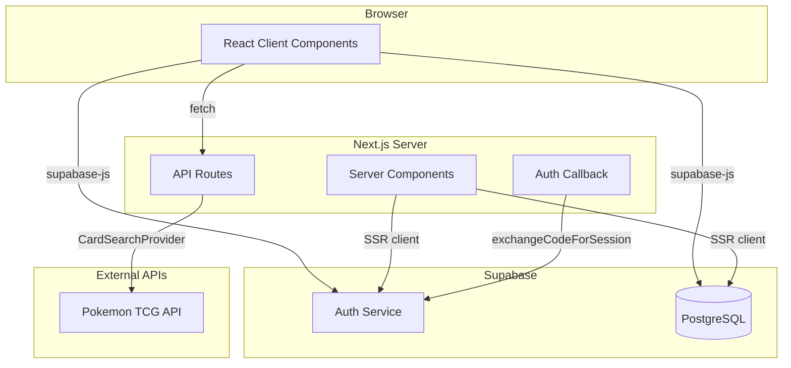
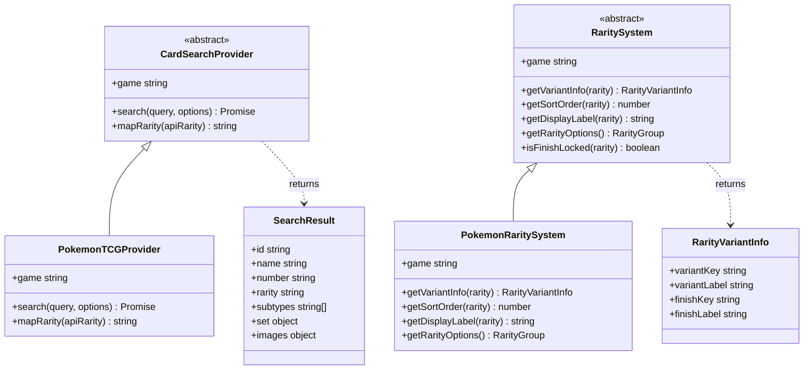
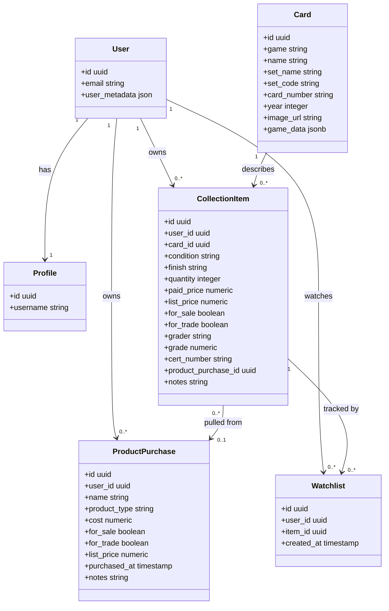
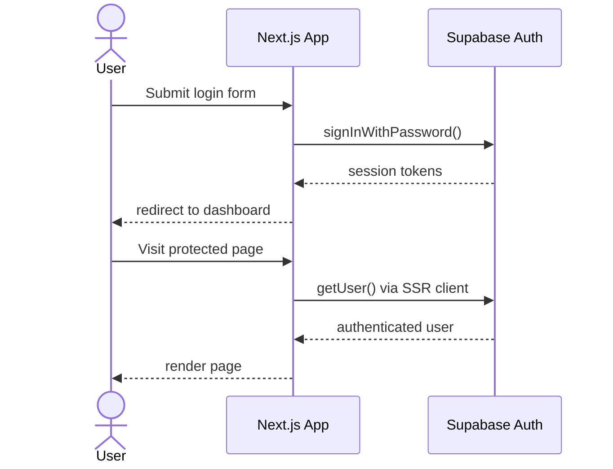
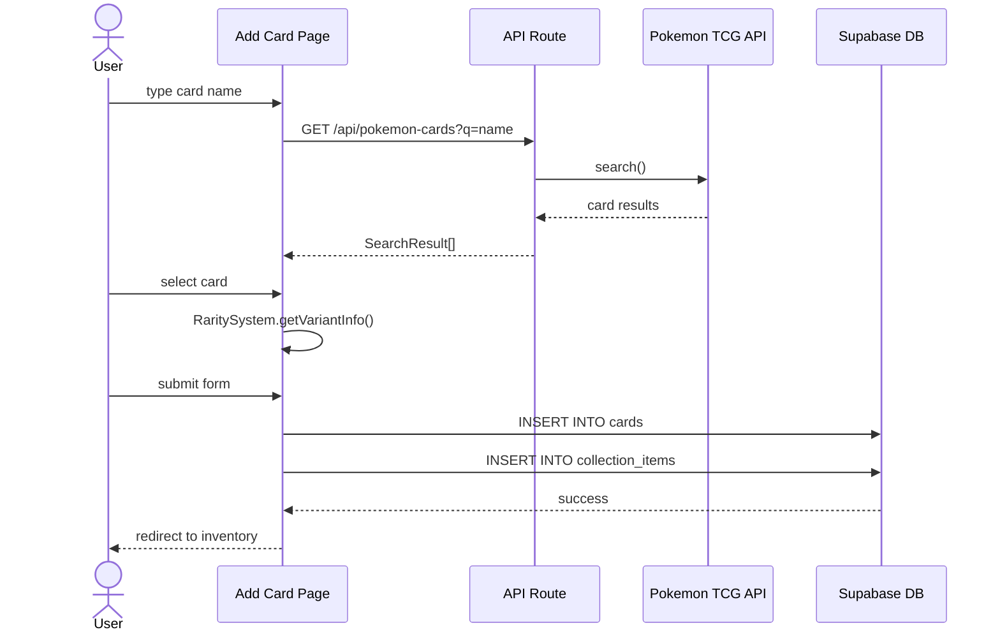

# Vaultset — Design Document

## 1. Overview

Vaultset is a full-stack web application for trading card collectors. It is built on **Next.js 16 App Router** with **React 19** and backed by **Supabase** (PostgreSQL + Auth). The application supports card collection management, a peer-to-peer marketplace, sealed product tracking, and a community hub.

The codebase is structured around a polymorphic game abstraction layer (`lib/`) that allows new trading card games to be supported by implementing two abstract classes — `CardSearchProvider` and `RaritySystem` — without modifying any existing application code.

---

## 2. System Architecture

---

## 3. Module Structure

| Layer | Path | Responsibility |
|---|---|---|
| Pages & Layouts | `app/` | Routing, data fetching, page composition |
| Components | `components/` | Reusable UI — forms, grids, nav |
| Game Abstraction | `lib/search/` | Pluggable card search per game |
| Game Abstraction | `lib/rarity/` | Pluggable rarity/variant/finish logic per game |
| Utilities | `utils/supabase/` | Supabase client factory (browser, server, admin) |
| Database | Supabase | PostgreSQL schema with row-level security |

---

## 4. Class Diagram

### 4.1 Game Abstraction Layer

### 4.2 Data Entities

---

## 5. Authentication Flow

---

## 6. Add Card Data Flow

---

## 7. Key Design Patterns

### Polymorphic Game Support
`CardSearchProvider` and `RaritySystem` are abstract base classes. Adding a new game (e.g. Magic: The Gathering) requires only implementing these two classes and registering the provider in `lib/search/index.ts`. No existing pages or components need to change.

### Server vs Client Components
Server Components (layouts, page data fetching) use the SSR Supabase client from `utils/supabase/server.ts`. Client Components (forms, interactive UI) use the browser client from `utils/supabase/client.ts`. Authentication state is shared via cookies, keeping the session consistent across both environments.

### Row-Level Security
All database tables enforce RLS policies in Supabase. Users can only read and write their own `collection_items`, `product_purchases`, and `watchlist` entries. Marketplace listings are readable by all authenticated users but writable only by the owner.

### Marketplace via Flags
There is no separate listings table. Cards and products are published to the marketplace by toggling `for_sale` or `for_trade` flags on `collection_items` and `product_purchases`. This keeps the data model simple and ensures inventory and marketplace are always in sync.
