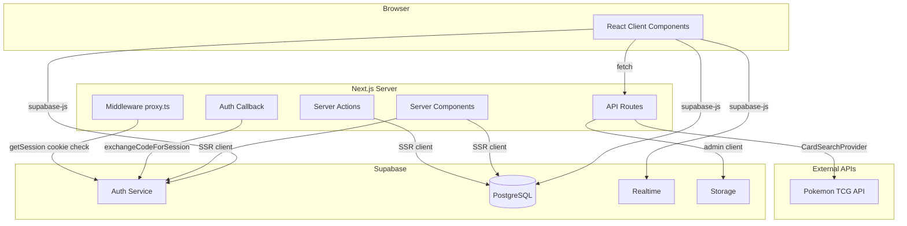
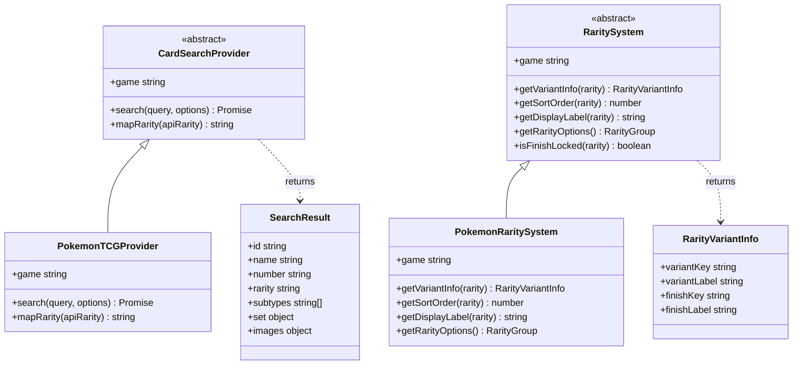
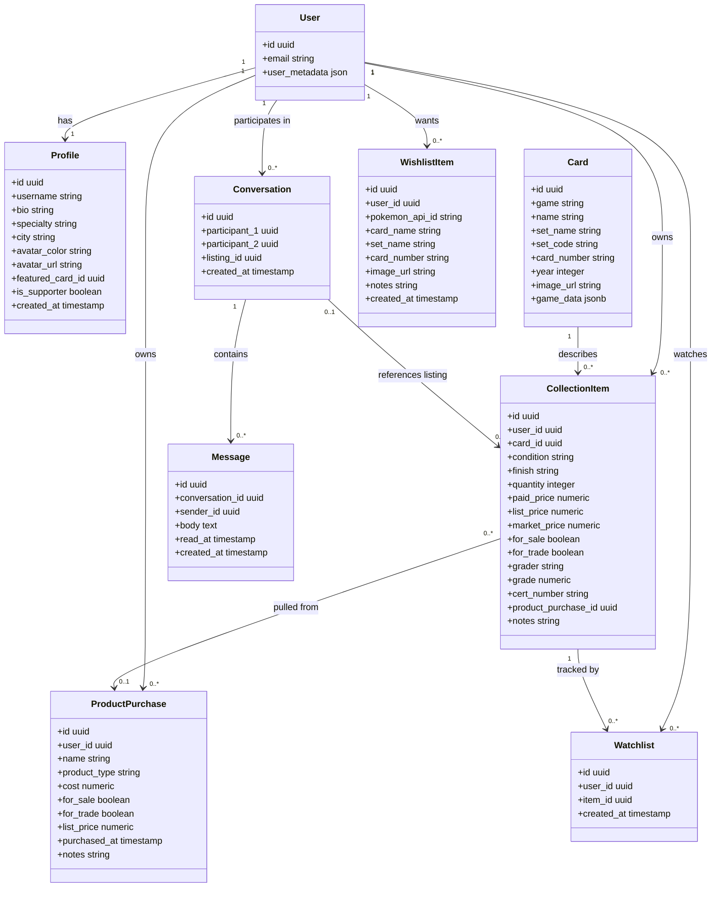
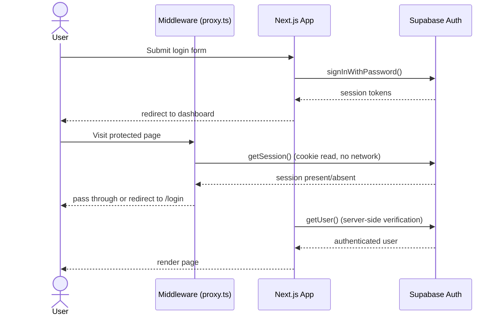
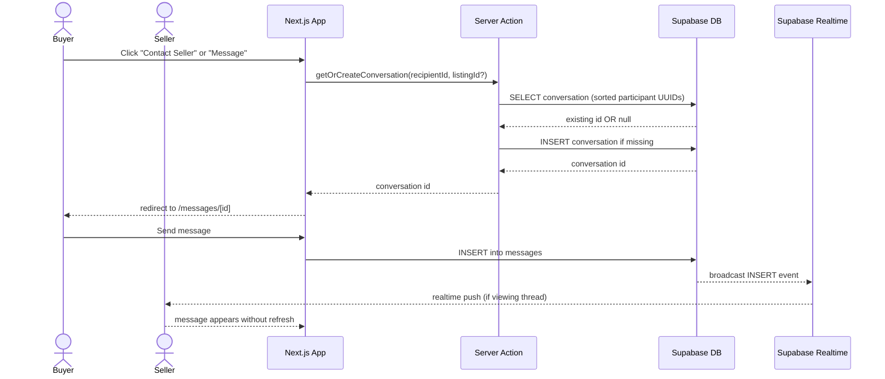
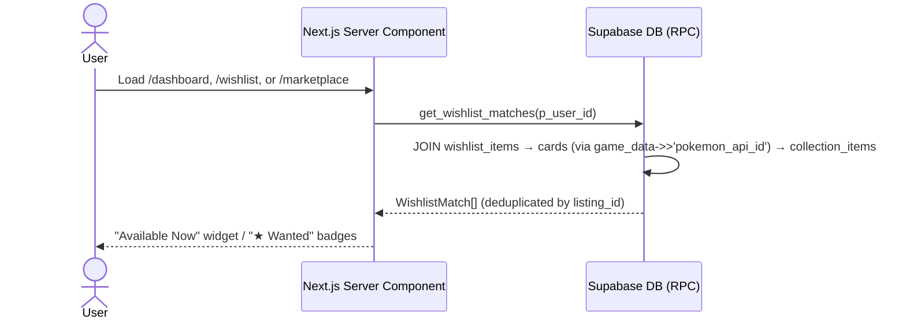

# Vaultset — Design Document

## 1. Overview

Vaultset is a full-stack web application for trading card collectors. It is built on **Next.js 16 App Router** with **React 19** and backed by **Supabase** (PostgreSQL + Auth + Realtime). The application supports card collection management, a peer-to-peer marketplace, sealed product tracking, in-app messaging, wishlists, and a community hub.

The codebase is structured around a polymorphic game abstraction layer (`lib/`) that allows new trading card games to be supported by implementing two abstract classes — `CardSearchProvider` and `RaritySystem` — without modifying any existing application code.

---

## 2. System Architecture

---

## 3. Module Structure

| Layer | Path | Responsibility |
|---|---|---|
| Pages & Layouts | `app/` | Routing, data fetching, page composition |
| Components | `components/` | Reusable UI — forms, grids, nav, messaging |
| Game Abstraction | `lib/search/` | Pluggable card search per game |
| Game Abstraction | `lib/rarity/` | Pluggable rarity/variant/finish logic per game |
| Shared Logic | `lib/wishlistMatches.ts` | Shared `WishlistMatch` type and dedupe helper |
| Shared Logic | `lib/avatarColors.ts` | Avatar color palette and resolution utilities |
| Shared Logic | `lib/moderation.ts` | `checkText()` — user content moderation |
| Shared Logic | `lib/products.ts` | Sealed product type definitions |
| Utilities | `utils/supabase/` | Supabase client factory (browser, server, admin) |
| Database | Supabase | PostgreSQL schema with row-level security |

### App Routes

| Route | Protection | Description |
|---|---|---|
| `/` | Public | Landing page |
| `/(auth)/login` | Public | Sign in |
| `/(auth)/register` | Public | Create account |
| `/(auth)/forgot-password` | Public | Password reset request |
| `/(auth)/update-password` | Public | Password reset via email link |
| `/auth/callback` | Public | Supabase post-login redirect handler |
| `/dashboard` | Auth required | Collection overview, stats, watchlist, wishlist |
| `/inventory` | Auth required | Card collection CRUD |
| `/inventory/add` | Auth required | Add card form |
| `/inventory/[id]/edit` | Auth required | Edit/delete card |
| `/inventory/products` | Auth required | Sealed product management |
| `/marketplace` | Public | Browse all sale/trade listings |
| `/marketplace/[id]` | Public | Listing detail with seller contact |
| `/messages` | Auth required | Conversation inbox |
| `/messages/[id]` | Auth required | Message thread with Realtime updates |
| `/community` | Public | Collector directory |
| `/account` | Auth required | Account settings (profile, password, delete) |
| `/profile/[username]` | Auth required | Public profile with tabs: listings, collection, wishlist |
| `/wishlist` | Auth required | Personal wishlist management |
| `/wishlist/add` | Auth required | Add card to wishlist |
| `/support` | Public | Ko-fi supporter link |

---

## 4. Class Diagram

### 4.1 Game Abstraction Layer

### 4.2 Data Entities

---

## 5. Authentication Flow

---

## 6. Messaging Flow

---

## 7. Wishlist Matching Flow

---

## 8. Add Card Data Flow

---

## 9. Key Design Patterns

### Polymorphic Game Support
`CardSearchProvider` and `RaritySystem` are abstract base classes. Adding a new game (e.g. Magic: The Gathering) requires only implementing these two classes and registering the provider in `lib/search/index.ts`. No existing pages or components need to change.

### Server vs Client Components
Server Components (layouts, page data fetching) use the SSR Supabase client from `utils/supabase/server.ts`. Client Components (forms, interactive UI, realtime) use the browser client from `utils/supabase/client.ts`. Authentication state is shared via cookies, keeping the session consistent across both environments.

### Row-Level Security
All database tables enforce RLS policies in Supabase. Users can only read and write their own `collection_items`, `product_purchases`, `watchlist`, `wishlist_items`, and `messages`. Marketplace listings and profiles are readable by all authenticated users. Conversations are readable only by their two participants.

### Marketplace via Flags
There is no separate listings table. Cards and products are published to the marketplace by toggling `for_sale` or `for_trade` flags on `collection_items` and `product_purchases`. This keeps the data model simple and ensures inventory and marketplace are always in sync.

### Server Actions for Mutations
Write operations that require auth context and a redirect use Next.js Server Actions (`"use server"` files). The messaging flow uses `app/messages/actions.ts` to find or create a conversation atomically before navigating to the thread.

### Conversation Uniqueness
Conversations between two users are deduplicated by sorting participant UUIDs lexicographically before insert, enforced by a Postgres CHECK constraint (`participant_1 < participant_2`). This ensures exactly one conversation row per user pair regardless of who initiates.

### Wishlist Matching via Postgres RPC
The `get_wishlist_matches(p_user_id)` RPC function joins `wishlist_items → cards → collection_items` using the JSONB field `cards.game_data->>'pokemon_api_id'`. This performs the match entirely in the database. Client code deduplicates by `listing_id` using the `dedupeMatches()` helper in `lib/wishlistMatches.ts`.

### User Content Moderation
All user-generated text fields (bio, specialty, city, wishlist notes, message bodies) are run through `checkText()` from `lib/moderation.ts` before being written to the database.
