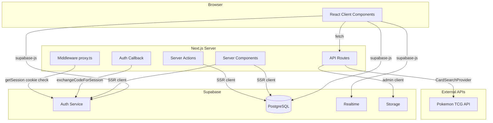
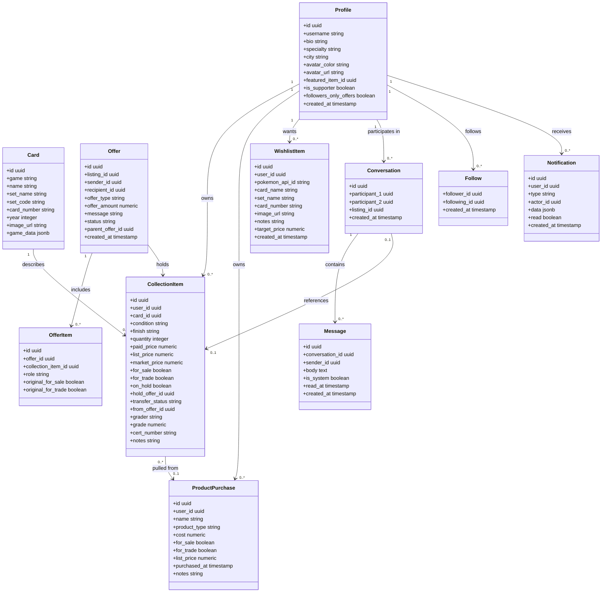
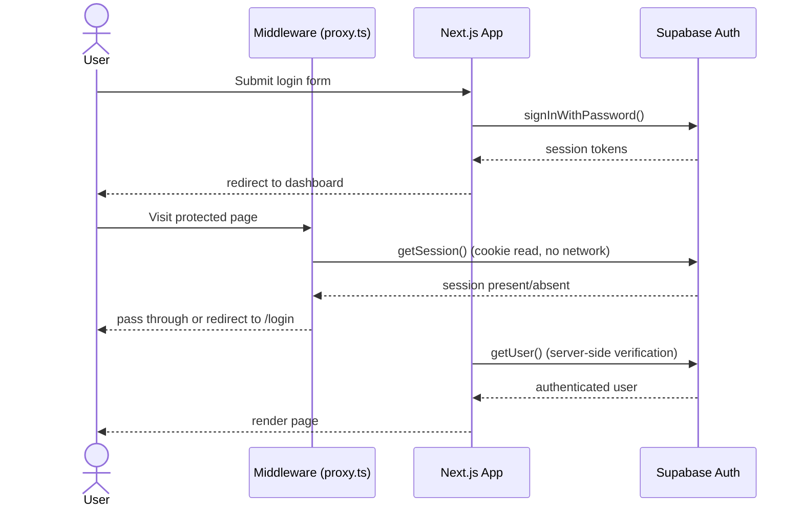
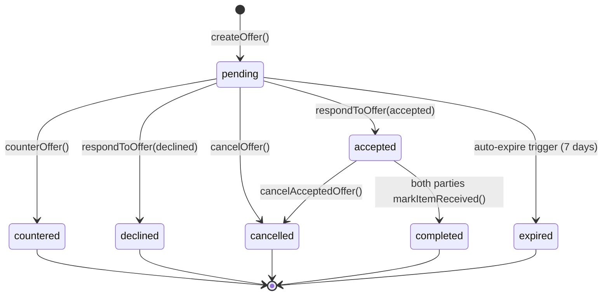
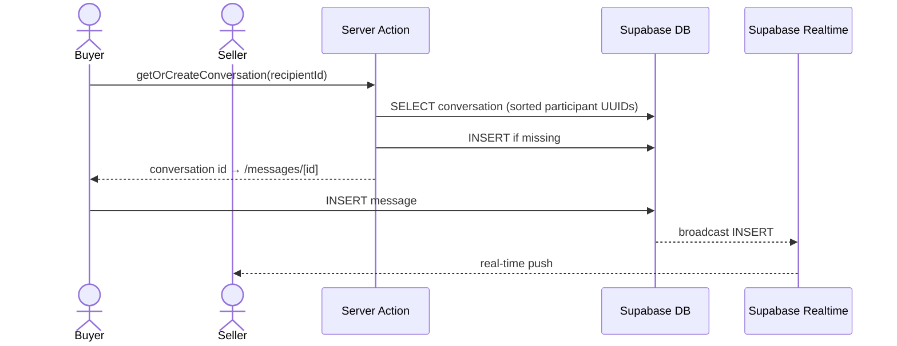
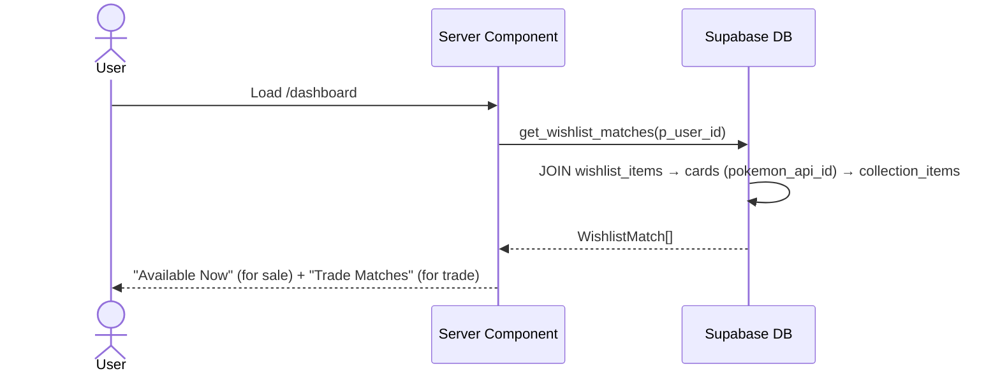

# Vaultset — Documentation

## Overview

Vaultset is a full-stack web application for trading card collectors built on **Next.js 16 App Router**, **React 19**, and **Supabase** (PostgreSQL + Auth + Realtime). It supports card collection management, a peer-to-peer marketplace with a full offer/trade system, sealed product tracking, in-app messaging, wishlists, a community hub, and a follower/social graph.

The codebase uses a polymorphic game abstraction layer (`lib/`) so new trading card games can be supported by implementing two abstract classes — `CardSearchProvider` and `RaritySystem` — without touching any existing application code.

---

## System Architecture

---

## Module Structure

| Layer | Path | Responsibility |
|---|---|---|
| Pages & Layouts | `app/` | Routing, data fetching, page composition |
| Components | `components/` | Reusable UI — forms, grids, nav, messaging |
| Game Abstraction | `lib/search/` | Pluggable card search per game |
| Game Abstraction | `lib/rarity/` | Pluggable rarity/variant/finish logic per game |
| Shared Logic | `lib/parseBio.tsx` | Bio text parser — renders `[label](/path)` as links |
| Shared Logic | `lib/wishlistMatches.ts` | `WishlistMatch` type and dedupe helper |
| Shared Logic | `lib/avatarColors.ts` | Avatar color palette and resolution utilities |
| Shared Logic | `lib/moderation.ts` | `checkText()` — user content moderation |
| Shared Logic | `lib/products.ts` | Sealed product type definitions |
| Shared Logic | `lib/timeAgo.ts` | Relative timestamp formatting |
| Utilities | `utils/supabase/` | Supabase client factory (browser, server, admin) |
| Database | Supabase | PostgreSQL schema with row-level security |

### App Routes

| Route | Protection | Description |
|---|---|---|
| `/` | Public | Landing page |
| `/(auth)/login` | Public | Sign in |
| `/(auth)/register` | Public | Create account |
| `/(auth)/forgot-password` | Public | Password reset request |
| `/(auth)/update-password` | Public | Password reset via email link |
| `/auth/callback` | Public | Supabase post-login redirect handler |
| `/dashboard` | Auth | Collection overview, stats, watchlist, wishlist, following feed |
| `/dashboard/report` | Auth | Printable collection report |
| `/inventory` | Auth | Card collection CRUD |
| `/inventory/add` | Auth | Add card form |
| `/inventory/[id]/edit` | Auth | Edit/delete card |
| `/inventory/products` | Auth | Sealed product management |
| `/marketplace` | Public | Browse all sale/trade listings |
| `/marketplace/[id]` | Auth | Listing detail with offer modal |
| `/marketplace/user/[username]` | Auth | Listings by a specific seller |
| `/offers` | Auth | Received and sent offers |
| `/offers/[id]` | Auth | Offer detail — accept, decline, counter, cancel |
| `/messages` | Auth | Conversation inbox |
| `/messages/[id]` | Auth | Message thread with Realtime updates |
| `/notifications` | Auth | New follower and offer notifications |
| `/community` | Auth | Collector directory with leaderboard |
| `/account` | Auth | Profile, password, followers-only-offers setting |
| `/profile/[username]` | Auth | Public profile — listings, collection, wishlist, follows |
| `/profile/[username]/followers` | Auth | List of followers |
| `/profile/[username]/following` | Auth | List of followed collectors |
| `/wishlist` | Auth | Personal wishlist management |
| `/wishlist/add` | Auth | Add card to wishlist |
| `/support` | Public | Ko-fi supporter link |

---

## Data Entities

---

## Key Flows

### Authentication

### Offer / Trade Lifecycle

On acceptance, inventory changes execute atomically before the status update:
- Seller's listing is held (`on_hold=true`, `for_sale`/`for_trade` cleared)
- A pending copy is created for the buyer (`transfer_status="pending"`)
- For trades: buyer's offered cards are also held and copied to seller
- Original availability flags stored in `offer_items` for restoration on cancel

Both parties must confirm receipt (`markItemReceived`) before completion. Either can cancel, which releases all holds and restores original flags.

### Messaging

### Wishlist Matching

---

## Design Patterns

### Polymorphic Game Support
`CardSearchProvider` and `RaritySystem` are abstract base classes. Adding a new game requires implementing both and registering them in `lib/search/index.ts` and `lib/rarity/index.ts`. No existing pages or components change.

### Server vs Client Components
Server Components use the SSR Supabase client (`utils/supabase/server.ts`). Client Components use the browser client (`utils/supabase/client.ts`). Auth state is shared via cookies.

### Marketplace via Flags
There is no separate listings table. Cards are published to the marketplace by toggling `for_sale` or `for_trade` on `collection_items`. Inventory and marketplace are always in sync.

### Server Actions for Mutations
Write operations that need auth context use Next.js Server Actions in co-located `actions.ts` files (e.g. `app/offers/actions.ts`, `app/profile/actions.ts`, `app/messages/actions.ts`).

### Conversation Uniqueness
Participants are sorted lexicographically before insert and a Postgres CHECK constraint (`participant_1 < participant_2`) enforces exactly one conversation per user pair.

### Wishlist Matching via RPC
`get_wishlist_matches(p_user_id)` joins `wishlist_items → cards → collection_items` using `game_data->>'pokemon_api_id'`. The client deduplicates by `listing_id` via `lib/wishlistMatches.ts`.

### Notifications via DB Triggers and API Routes
Most notifications are created by `SECURITY DEFINER` Postgres triggers:
- `follows_notification_trigger` — fires on `follows` INSERT → creates `new_follower` notification
- `offers_notification_trigger` — fires on `offers` INSERT → creates `new_offer` notification for recipient
- `auto_expire_on_offer_change` — fires on `offers` INSERT/UPDATE → sets stale pending offers to `expired`

Price alert notifications are created by the market refresh API route (`/api/market-refresh`) after prices update, using the `check_wishlist_price_alerts(p_user_id)` RPC to find listings at or below each wishlist item's `target_price`. Duplicates are suppressed by checking for existing `price_alert` notifications with the same `listing_id`.

### Row-Level Security
All tables enforce RLS. Users read/write only their own data. Marketplace listings and profiles are readable by all authenticated users. Conversations are readable only by their two participants. Notifications are readable only by their recipient.

### Admin Client for Privileged Writes
Operations that span multiple users (offer acceptance, cancellation, inventory transfer) use the service-role client from `utils/supabase/admin.ts` to bypass RLS safely within server actions.

---

## User Guide

### Getting Started

**Creating an account**
1. Click **Start for Free** on the homepage
2. Enter a username, email, and password
3. Click **Create Account** and confirm your email

**Signing in** — click **Sign in**, enter email and password.

**Forgot password** — click **Forgot password?** on the login page and follow the email link.

---

### Dashboard

Your home base. Shows:
- **Total Cards / Collection Value / Active Listings / Pending Trades** — live stats
- **Available Now** — wishlist cards currently listed for sale by other collectors
- **Trade Matches** — wishlist cards other collectors are willing to trade
- **Following Feed** — recent listings from collectors you follow
- **Recently Added** — your last 8 inventory additions
- **Watchlist / Wishlist** — quick access panels

**Quick actions:** Add Card · Browse Market · Start a Trade · View Profile

---

### Inventory

Split into **Cards** and **Products**.

**Adding a card**
1. Go to Inventory → **Add Card**
2. Search by card name and select the correct result
3. Set condition, quantity, paid price, list price, for sale/trade toggles, and grading info
4. Click **Save**

**Sealed Products** — manage booster boxes, ETBs, bundles. Track cost, link pulled cards, and list for sale or trade.

---

### Marketplace

Browse all community listings.

- **Search** by card name
- **Filters:** All · For Sale · For Trade · Graded · ★ Wanted · Following
- **Following filter** — shows only listings from collectors you follow
- **★ Wanted** — appears when wishlist cards are listed; wanted cards float to the top
- **Make Offer →** — on each listing card, links to the listing detail where you can make a cash offer, propose a trade, or request a bundle

---

### Offers & Trades

Accessed from any listing detail page. Three offer types:

| Type | Description |
|---|---|
| **Cash Offer** | Propose a dollar amount for the listing |
| **Trade Offer** | Select cards from your inventory to offer in exchange |
| **Bundle Request** | Request additional cards from the seller's inventory |

**Offer lifecycle:** pending → accepted → (both confirm receipt) → completed. Either party can cancel an accepted deal; all held inventory is restored automatically.

**Counter-offers** — recipients can counter a cash offer with a different amount. Roles reverse and a new pending offer is created.

Offers expire after 7 days if not responded to.

**Dispute reporting** — a **Report a problem** link appears on accepted and completed offer detail pages. Submitting the form opens a direct message thread with support pre-filled with the offer ID, card name, and the user's description.

---

### Followers & Following

- **Follow** a collector from their profile page — button appears next to Share and Message
- **Followers / Following counts** on profile headers are clickable links to the full lists
- **"Follows you"** label appears below the Follow button when the relationship is mutual
- **"Followed by @x and N others you follow"** — shown on profiles of collectors your network already follows
- **Following feed** on the dashboard surfaces their recent listings
- **Following filter** on the Marketplace shows only their listings

**Followers-only offers** — in Account Settings, toggle this on to restrict offer buttons to your followers only.

---

### Notifications

A bell icon in the nav bar shows unread count. Click it to go to `/notifications`.

Notification types:
- **New follower** — someone followed you (links to their profile)
- **New offer** — someone made an offer on your listing (links to the offer)
- **Price alert** — a wishlist card is listed at or below your target price (links to the listing)

Notifications are marked read when you open the notifications page.

---

### Messages

- **Start a conversation** from any listing (Contact Seller) or profile (Message)
- Existing conversations are reused — one thread per user pair
- Messages appear in real time without a page refresh
- Gold badge on the Messages nav link indicates unread messages

---

### Wishlist

Track cards you are looking for. Publicly visible on your profile.

1. Wishlist → **Add Card** → search and select
2. Optionally add a note (e.g. "NM only")
3. Optionally set a **price alert** — enter a target price and you'll be notified whenever a listing for that card drops to or below it
4. When a wishlist card is listed by another collector, it surfaces on your dashboard and in the marketplace with a **★ Wanted** badge

---

### Profile

Every user has a public profile at `/profile/[username]` showing:
- Avatar, username, join date, city, bio, specialty
- Follower / following counts (clickable)
- Mutual followers from your network
- Wishlist cross-reference banner (if they have cards you want)
- Tabs: Listings · Collection · Wishlist

**Editing your profile** — go to Account Settings to update bio, specialty, city, avatar, featured card, and offer privacy settings.

**Admin bio** — the platform admin's bio supports `[label](/path)` link syntax and renders in an expanded block.

---

### Community

Lists all collectors with follower counts. Includes a **Top Collectors** leaderboard ranked by follower count.

---

### Account Settings

| Setting | Description |
|---|---|
| Username | Your display name across the platform |
| Email | Used for login and notifications |
| Bio | Short description on your profile (500 chars for admin, 160 for others) |
| Specialty | Collecting focus shown as a badge |
| City | Location shown on profile and community directory |
| Avatar | Color picker or photo upload |
| Featured Card | Pinned card shown at the top of your profile |
| Followers-only offers | Restrict offer buttons to your followers |
| Password | Change your login password |
| Delete Account | Permanently removes your account and all data |
