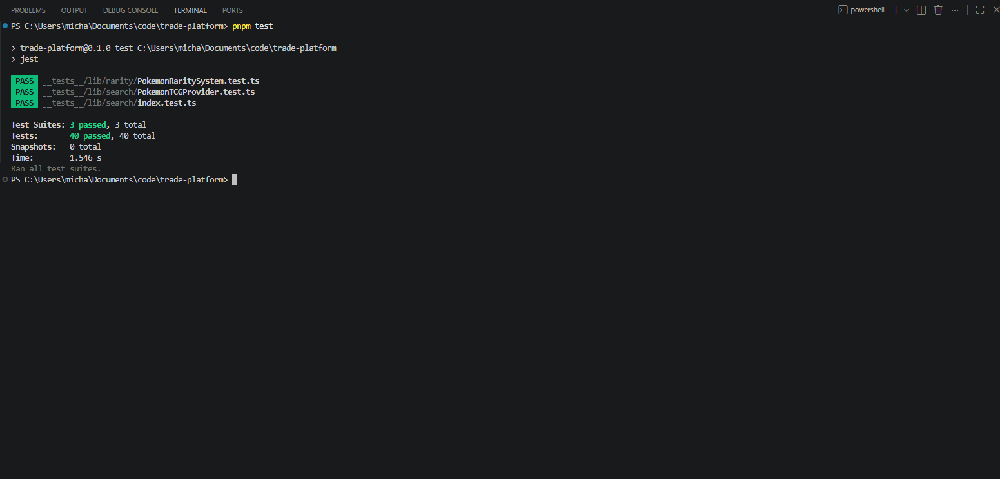
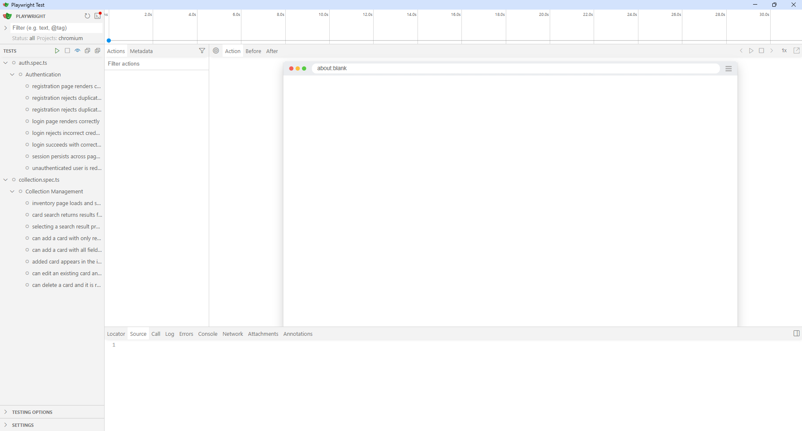
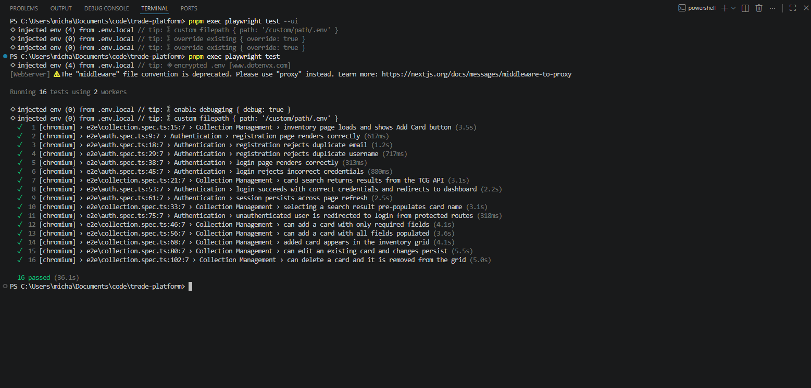
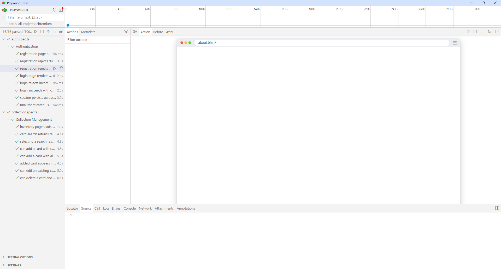
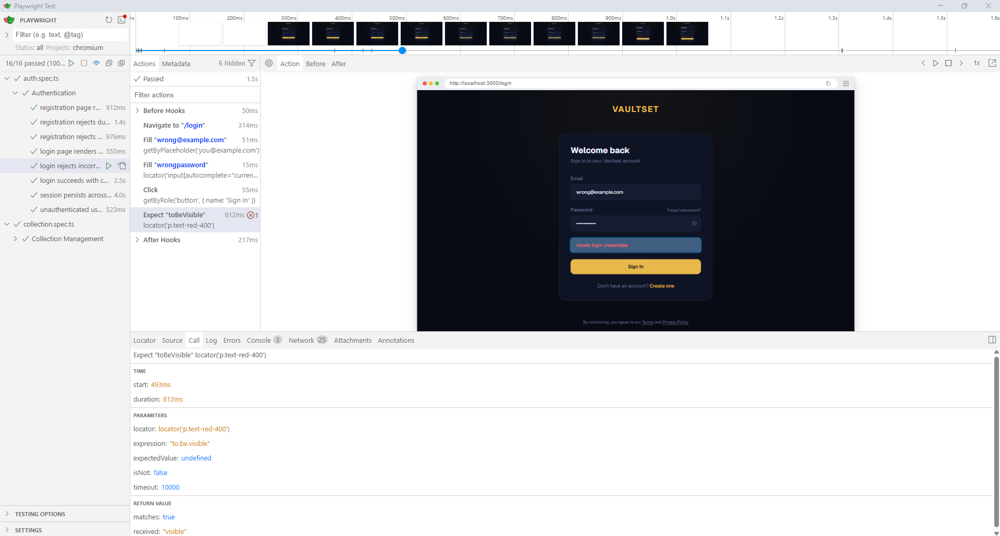

# Vaultset — Test Results

## Run Summary

| Date | 2026-05-16 |
|---|---|
| Tester | Michael Miethe |
| Environment | Windows 11, localhost:3000, Supabase cloud |
| Unit test tool | Jest 30.4.2 |
| E2E test tool | Playwright 1.60.0 (Chromium) |

---

## Unit Test Results

**Command:** `pnpm test`
**Result: 40 / 40 passed**

### Suite 1 — PokemonRaritySystem

| ID | Test Case | Result |
|---|---|---|
| U-01 | game identifier | PASS |
| U-02 | getVariantInfo — hyper_rare | PASS |
| U-03 | getVariantInfo — double_rare | PASS |
| U-04 | getVariantInfo — ultra_rare | PASS |
| U-05 | getVariantInfo — special_illustration_rare | PASS |
| U-06 | getVariantInfo — common (null) | PASS |
| U-07 | getVariantInfo — uncommon (null) | PASS |
| U-08 | getVariantInfo — rare (null) | PASS |
| U-09 | getVariantInfo — unknown (null) | PASS |
| U-10 | getSortOrder — hyper_rare (0) | PASS |
| U-11 | getSortOrder — common (15) | PASS |
| U-12 | getSortOrder — unknown (999) | PASS |
| U-13 | getSortOrder — hyper_rare above special_illustration_rare | PASS |
| U-14 | getSortOrder — special_illustration_rare above illustration_rare | PASS |
| U-15 | getSortOrder — illustration_rare above common | PASS |
| U-16 | getDisplayLabel — common | PASS |
| U-17 | getDisplayLabel — hyper_rare | PASS |
| U-18 | getDisplayLabel — double_rare | PASS |
| U-19 | getDisplayLabel — special_illustration_rare | PASS |
| U-20 | getDisplayLabel — unknown fallback | PASS |
| U-21 | isFinishLocked — fixed rarities | PASS |
| U-22 | isFinishLocked — common | PASS |
| U-23 | isFinishLocked — uncommon | PASS |
| U-24 | isFinishLocked — rare | PASS |
| U-25 | getRarityOptions — group count | PASS |
| U-26 | getRarityOptions — modern group | PASS |
| U-27 | getRarityOptions — legacy group | PASS |
| U-28 | getRarityOptions — option integrity | PASS |
| U-29 | getRarityOptions — modern contains hyper_rare | PASS |
| U-30 | getRarityOptions — legacy contains rare_holo_vmax | PASS |

### Suite 2 — PokemonTCGProvider

| ID | Test Case | Result |
|---|---|---|
| U-31 | game identifier | PASS |
| U-32 | mapRarity — basic rarities | PASS |
| U-33 | mapRarity — modern rarities | PASS |
| U-34 | mapRarity — legacy rarities | PASS |
| U-35 | mapRarity — case insensitive | PASS |
| U-36 | mapRarity — hyper rare aliases | PASS |
| U-37 | mapRarity — unknown returns empty string | PASS |

### Suite 3 — Search Provider Registry

| ID | Test Case | Result |
|---|---|---|
| U-38 | getSearchProvider — pokemon | PASS |
| U-39 | getSearchProvider — fallback | PASS |
| U-40 | getSearchProvider — singleton | PASS |

---

## End-to-End Test Results

**Command:** `pnpm exec playwright test`

### Suite 4 — Authentication

| ID | Test Case | Result |
|---|---|---|
| E-01 | Registration page renders | PASS |
| E-02 | Duplicate email rejected | PASS |
| E-03 | Duplicate username rejected | PASS |
| E-04 | Login page renders | PASS |
| E-05 | Incorrect credentials rejected | PASS |
| E-06 | Correct credentials accepted | PASS |
| E-07 | Session persists on refresh | PASS |
| E-08 | Protected route redirects unauthenticated user | PASS |

### Suite 5 — Collection Management

| ID | Test Case | Result |
|---|---|---|
| E-09 | Inventory page loads | PASS |
| E-10 | Card search returns results | PASS |
| E-11 | Search pre-populates form | PASS |
| E-12 | Add card with required fields only | PASS |
| E-13 | Add card with all fields | PASS |
| E-14 | Added card appears in grid | PASS |
| E-15 | Edit card and changes persist | PASS |
| E-16 | Delete card and removed from grid | PASS |

---

## Bug Log

### BUG-001 — `RARITY_VARIANT_MAP` not defined in Add Card page

| Field | Detail |
|---|---|
| **ID** | BUG-001 |
| **Discovered** | E2E test E-11 (selecting a search result pre-populates card name) |
| **File** | `app/inventory/add/page.tsx`, line 208 |
| **Severity** | High — selecting any card from the TCG API search caused an uncaught runtime error, making it impossible to use the search-assisted card entry flow |
| **Description** | `handlePokemonSelect` referenced `RARITY_VARIANT_MAP` directly, but this variable was never defined in the file. The rarity system abstraction (`PokemonRaritySystem`) was already instantiated at module level as `raritySystem`, and `getVariantInfo()` is the correct method to use. |
| **Root Cause** | Incomplete refactoring — the code was written to use a local inline map (`RARITY_VARIANT_MAP`) but was never defined after the rarity logic was extracted into `lib/rarity/PokemonRaritySystem.ts`. |
| **Fix Applied** | Replaced `RARITY_VARIANT_MAP[mappedRarity]` with `raritySystem.getVariantInfo(mappedRarity)` |
| **Status** | Resolved |

---

## Summary of Changes Resulting from Testing

| Change | Type | File | Triggered By |
|---|---|---|---|
| Replaced `RARITY_VARIANT_MAP[mappedRarity]` with `raritySystem.getVariantInfo(mappedRarity)` | Bug fix | `app/inventory/add/page.tsx` | BUG-001, discovered during E2E test E-11 |
| Fixed Playwright search input selector from `/search/i` to `"Card name…"` | Test fix | `e2e/collection.spec.ts` | Selector did not match actual placeholder text |
| Fixed search result selector from ARIA role to `ul.absolute li button` | Test fix | `e2e/collection.spec.ts` | Results dropdown uses no ARIA role attributes |
| Added `exact: true` to condition button selectors | Test fix | `e2e/collection.spec.ts` | `"Mint"` was matching `"Near Mint"` as a substring |
| Updated edit/delete selectors to use `.group` container with `hasText` | Test fix | `e2e/collection.spec.ts` | Previous DOM traversal selectors were too fragile |
| Added `dotenv` dependency and loaded `.env.local` in Playwright config | Configuration fix | `playwright.config.ts` | E2E test credentials were not reaching the test process |
| Updated duplicate username test to use `"Tester99"` | Test fix | `e2e/auth.spec.ts` | Hardcoded username did not match an existing account |
| Increased search dropdown timeout from 10 s to 15 s on E-10 and E-11 | Test fix | `e2e/collection.spec.ts` | TCG API response time variability caused intermittent timeout failures on first run |
| Added `e2e/global-teardown.ts` and registered in `playwright.config.ts` | Test infrastructure | `e2e/global-teardown.ts`, `playwright.config.ts` | Test cards added during each run were persisting in the database; teardown now deletes all `collection_items` for the E2E test account automatically after each run |
